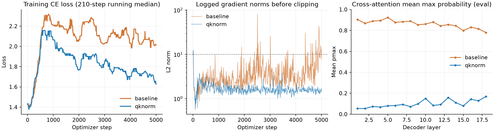
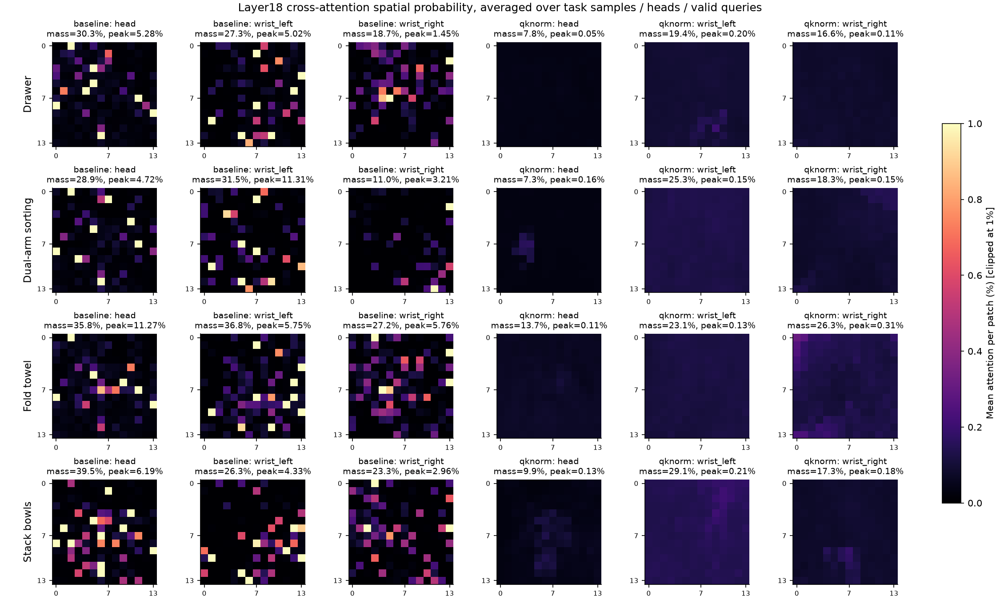

# QK normalization 5k实测结果（2026-10-02）

QK normalization试验已经完成5,000更新，step_005000及last已保存。
SwanLab：<https://swanlab.cn/@game-loader/fastwam-dinov3-q/runs/dzpx8sg9>。
远端目录：`/data/workspace/droid_fastwam_q_20260930/production_qknorm_20261002_1048/`。

## 稳定性对照

以下比较旧math-only正式run前5k与新QK norm run的前5k，batch64、seed42、原LR/dropout/EMA/TD一致，
均从原预训练DINO和新初始化decoder开始。不是用旧45k和新5k比较，也不是多seed重复实验。
每10步记录一次，最大值/裁剪比例仅覆盖已记录点；不得解释为每次optimizer update全量统计。

| 指标 | 原math-only 5k | QK norm 5k |
|---|---:|---:|
| 全5k loss中位数 | 2.105 | 1.826 |
| 全5k HL-KL中位数 | 0.994 | 0.718 |
| 全5k梯度中位数 | 2.849 | 1.600 |
| 已记录最大裁剪前梯度 | 80.701（step2510） | 12.359（step10） |
| 已记录裁剪比例 | 6.19% | 0.20% |
| 最后100个日志点loss中位数 | 2.062 | 1.731 |
| 最后100个日志点HL-KL中位数 | 0.964 | 0.634 |
| 最后100个日志点梯度中位数 | 4.150 | 1.552 |
| 最后100个日志点梯度最大值 | 43.076 | 2.075 |
| 最后100个日志点裁剪比例 | 20% | 0% |
| 最后100个日志点TD MAE中位数 | 0.03131 | 0.01448 |

最终单点step5000：loss1.56173、HL-KL0.46824、grad_norm1.53940；峰值allocated16.633GiB。
在已测5k窗口内，梯度及TD拟合比原版平稳；没有证明45k长期稳定或候选动作排序提升。
两个run的TD标签随自身EMA变化，训练KL/TD误差不是同一固定真值下的独立评估。

## 注意力从硬选择变为多token分配

检查两个5k保存权重，使用相同采样计划update2030/2031/2032，三批64，共192个chunk，覆盖四任务。
每层98,816有效head/query行；排除动作padding，文本padding由原mask屏蔽。
分别重放train（原dropout）与eval（无dropout），无optimizer/backward。
从实际BF16 Q/K显式禁用autocast和TF32，用FP32重算dropout前softmax。

| eval全部18层统计 | 原math-only 5k | QK norm 5k |
|---|---:|---:|
| cross近one-hot（pmax>1-1e-7） | 22.38% | 0% |
| self近one-hot | 42.19% | 0% |
| cross平均pmax | 86.05% | 9.92% |
| self平均pmax | 83.21% | 30.97% |
| cross平均熵（nats） | 0.4235 | 4.4586 |
| self平均熵（nats） | 0.5245 | 2.2226 |
| cross score最大绝对值 | 3243 | 7.990 |

train全部层cross/self近one-hot也为0%。第17/18层eval cross平均pmax12.77%/16.88%，
不是每行均匀概率约0.16%；仍有选择能力，但读入多个token。
QK norm的固定scale8本来就限制score范围，因此“0%近one-hot”主要验证预期机制，
不能当作模型已经学到正确对象或有效动作排序的独立证据。

## 实际关注哪些token：使用概率质量，不把top1次数当权重

现在attention不饱和，“某token经常排第一”与“它占大部分注意力”区别很大。
因此增强探针，记录逐head、逐任务、逐key的平均概率质量；保持原始top1直方图。
原始输出在`analysis/token_mass_20261002/{qknorm,baseline}/`，没有覆盖训练结束时的旧检查。

### 文本与三路相机

| QK norm eval cross层 | 文本质量 | 头部 | 左腕 | 右腕 |
|---|---:|---:|---:|---:|
| 1 | 18.60% | 22.71% | 31.74% | 26.95% |
| 6 | 26.98% | 24.92% | 23.85% | 24.25% |
| 12 | 28.43% | 10.55% | 32.80% | 28.21% |
| 17 | 39.64% | 13.81% | 23.60% | 22.95% |
| 18 | 44.16% | 10.80% | 23.55% | 21.49% |

第18层，按任务、heads及有效query平均，具体文本token注意力：

- 毛巾：`towel`18.81%、`Fold`17.65%；原版后层忽略文本的现象明显减轻。
- 叠碗：`Stack`13.04%、`together`7.01%、`three`6.95%、`bowl`5.26%。
- 抽屉：四个不同位置的`the`分别4.41–5.30%，`drawer`2.94%、`Open`2.83%、
  `charger`2.68%；并非所有head都聚焦动作词。
- 双臂投放：多个`the`各约2.2–2.45%，`square`1.80%、`screw`1.61%。

text[0]/[2]在不同任务是不同词，所有语义解释均通过checkpoint tokenizer映射。
T5 token已上下文化，因此功能词/标点占权重不代表没有任务语义，也不证明语义理解正确。

不同head已经分工：第18层head0约67.0%概率质量给右腕；head10约65.7%给左腕；
head12约37.8%给头部、35.2%给右腕；head1–4等主要读文本。

### 图像：概率分布明显更宽，仍有位置偏好

第18层按任务平均后，最强的单个视觉patch仅约0.16–0.31%的总注意力质量；
原5k最强单个patch可达5.28–11.31%。这不是说某个特定head任何时候都没有集中，
而是对比同样的任务/head/query池化统计。

当前常见位置包括：抽屉的左腕patch(11,9)/(9,10)，叠碗的左腕(2,10)/(4,9)，
毛巾的右腕(0,0)/(0,1)/(1,0)，双臂任务的头部(7,4)/(7,3)。
毛巾右腕仍偏向边缘区域；本轮没有把这些平均图直接解释成已跟踪实际物体。

热图是任务样本/head/有效query平均，不是单张RGB上的因果归因；所有图共用0–1%色标，
原版超过1%的patch截顶显示，并在标题给出真实peak及相机总质量。

### 动作：末端偏好仍在，但不再几乎全权重压到一个token

第18层self-attention，`action[31]`排第一的频率为61.55%，但平均实际权重为**30.97%**。
第30/29/28步分别为13.02%/8.12%/6.00%。原版最后一步平均权重为46.97%。
当前第17/18层self仍有1.43%/2.16%行pmax>0.99（严格近one-hot阈值下为0），
不能说所有head完全不集中。各动作token已含前面decoder层混合信息。

第17/18层cross中动作query与CLS的top1一致率从原5k86.60%/88.72%降到63.38%/64.18%。
路由同质化减轻，但还有约一半sample/head组合所有有效query共享top1。
这些top1统计不等于整个概率分布相同，也不能判断Q是否忽略动作。

## 可复核文件与限制

- `run/step_005000/`与`run/last/`：完成的checkpoint；不会自动延长到45k。
- `analysis/attention_005000/`、`analysis/baseline_math_005000/`：原自动检查。
- `analysis/token_mass_20261002/`：本轮增加逐token概率质量后的两模型只读复核；
  包括`comparison_data.json`、两模型summary/每批原始计数及probability mass。
- 每批每head的概率质量和均检查为1（误差<1e-5），任务池化质量也符合；masked text质量为0。
- 工具Ruff通过；custom suite896 passed、7 skipped。

这些192个chunk来自训练池，并非留出数据；仍需独立数据固定回报及候选动作排序检验。
本轮可以确认的是5k数值稳定性、概率饱和和路由统计改善，不能据此宣称具身任务成功率改善。
没有续训、操作机器人、修改共享环境或重建视频cache；没有写入ARA。
