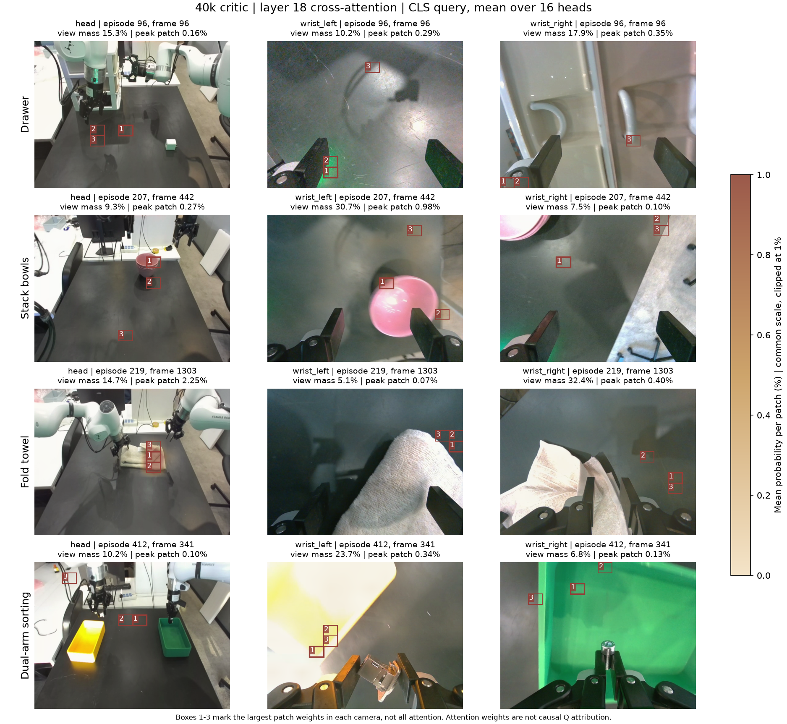
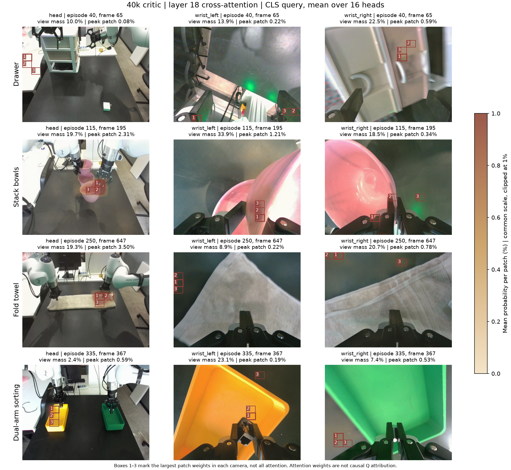
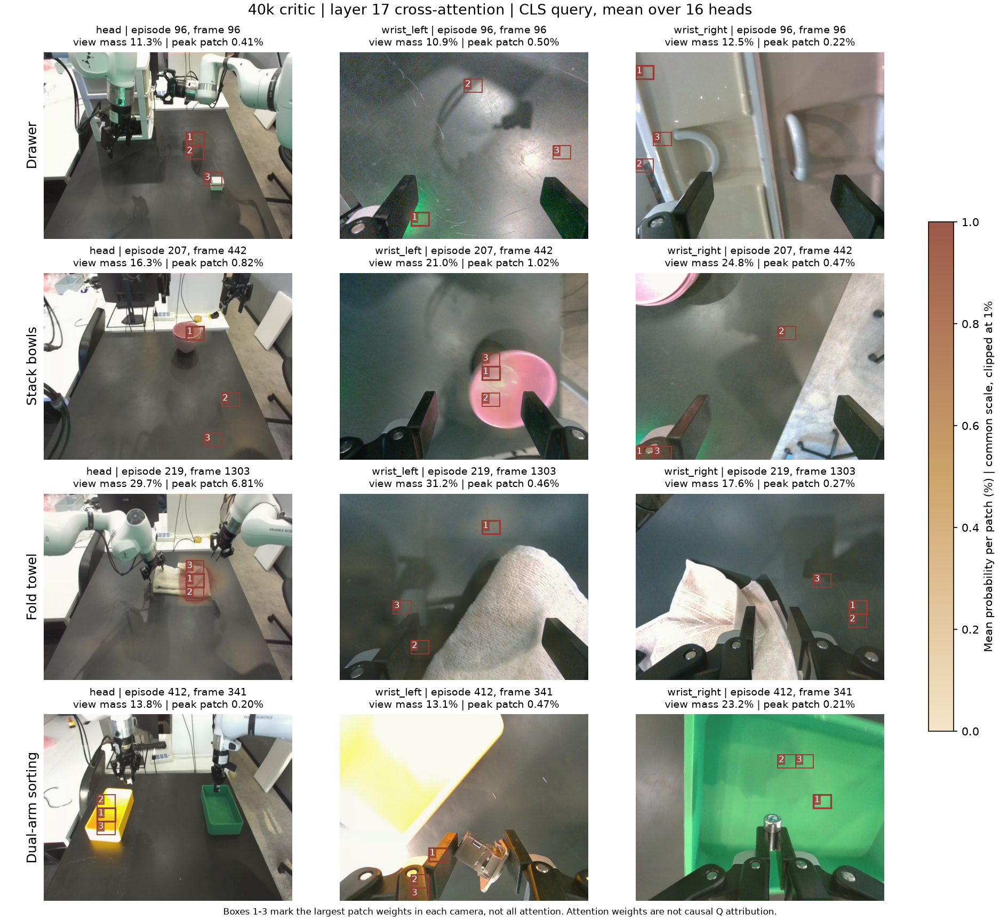

# 40k critic 的图像注意力落在哪里（2026-10-03）

## 本轮检查

使用QK normalization最终权重：
`/data/workspace/droid_fastwam_q_20260930/production_qknorm_40k_20261002_1455/run/step_040000`。

原配对计划update2030的batch64，按计划顺序取每任务前两个不同episode，共8个观测、24张相机RGB。
没有按热图好坏挑选。读取现有lossless cache，不重新解码视频或生成cache。
eval前向，BF16实际Q/K显式用FP32重算attention，mask保持一致；无反向、无optimizer、无权重更新。
捕获第1/6/12/17/18层cross-attention，既保存CLS query，也保存所有有效query的均值。
36个decoder attention调用，概率总和最大误差2.98e-7。

之前“图像51%”等统计，是对三个batch、全部heads及所有有效query池化。
本页主要展示**单个观测、用于Q读出的CLS query、16个head均值**，不能混作同一统计口径。
图像分辨率先无裁剪resize至224×224，对应14×14patch；绘图再把该网格拉伸回实际RGB坐标。

## 空间结论：物体区域和背景偏好同时存在

| 任务 | 在真实图像中观察到的热点 | 尚存的问题 |
|---|---|---|
| 叠碗 | 头部视角的碗/操作区；左腕的碗沿、碗内侧和夹爪接触附近；另一个episode右腕也读碗沿/夹爪 | 部分head/query仍读取桌面或边界 |
| 叠毛巾 | 两个episode的头部热点都落在毛巾中部偏右、折叠边缘区域 | 腕部最强patch常位于桌面、画面边缘，而不是毛巾正中 |
| 双臂分拣 | 头部第17层偏黄盒区域；左腕第18层能读黄盒边缘/内侧；右腕读绿盒内壁/区域 | 不能认定已定位小螺丝或方块；还有桌面、夹爪底座偏好 |
| 抽屉 | 右腕部分热点在抽屉内壁/侧边；左腕部分热点在机械臂/夹爪附近 | 头部热点多为桌面/阴影，没有稳定聚焦充电器；右腕也读下角机械结构 |

这些描述是8个实际图像的人工视觉检查，不是ROI标注后的大样本定位准确率。
“关注某物体”仅指attention对应patch位于该区域，不代表模型已建立正确的物体或动作语义。

## 具体例子与概率

- 毛巾ep219/frame1303：第18层CLS的头部patch(6,8)位于毛巾右侧区域，
  平均权重**2.252%**（占全部text+三图context概率）；第17层同patch为**6.812%**。
  ep250/frame647的头部patch(6,8)也在毛巾区域，第18层**3.499%**。
  两张毛巾本来就在相近工作区，不能仅凭这两张证明模型会追踪移位后的毛巾。
- 叠碗ep207/frame442：第18层左腕patch(6,8)约**0.981%**，在碗沿附近。
  ep115/frame195：头部patch(6,8)约**2.307%**，在碗/夹爪附近，左腕patch(11,9)
  约**1.214%**，在碗沿/夹爪接触附近。
- 分拣ep335/frame367：第17层头部patch(6,3)/(7,3)落在黄盒区域，
  第18层仍有相同区域偏好，但整个头部view的CLS质量仅约**2.42%**；
  第18层左腕view约**23.15%**，热点在黄盒内部/边缘附近。
- 抽屉ep96/frame96：第18层头部top3patch落在桌面/影子；白色充电器在画面更右侧，
  不属于这个观测该层的top3。右腕top1在下左角机械结构，另一热点在抽屉内壁。

每个DINO patch特征已经过全局self-attention，背景patch可能包含全局信息。
但本次不能因此把所有背景热点都辩护为有用：需要图像遮挡/替换对照或独立行为评价。

## 叠加图

红框1/2/3为**各相机内平均权重最大的三个patch**，并不是仅有这三个patch被读取。
热图使用统一绝对色标0–1%，超过1%截顶，真实最大值在每幅标题中注明。
所有百分比都以全部context为分母，未将单个相机重新归一化成100%。
跨head平均会掩盖某些head的集中，所以也保存了逐head概率供后续复核。

### 第18层CLS：第一组观测

### 第18层CLS：第二组不同episode

### 第17层CLS：第一组

第18层不是所有信息必须经过的唯一通道，残差包含前面层信息。
不能用某一层热点是否落在物体上直接判断Q有效性。
尤其不能把attention概率当成V幅度、输出投影后的贡献或因果重要性。

## 文件与生成过程

远端原始捕获目录：
`/data/workspace/droid_fastwam_q_20260930/production_qknorm_40k_20261002_1455/analysis/spatial_rgb_20261003/`。

- `probabilities.npz`：8观测×16head的CLS/有效query均值概率，第1/6/12/17/18层。
- `metadata.json`：episode、frame、任务、原cache row、相机文件、选择方法及Q输出。
- `sample_NN_viewV.png`：与概率匹配的实际RGB帧。
- `figures/`：完整原图、CLS及所有query叠加图，各两组不同episode。
- 本地`reports/spatial40k_20261003/`保留第17/18层叠加图、统计和元数据。

生成脚本：`scripts/fastwam_q/capture_spatial_attention.py`、`render_spatial_attention.py`。
surface class为internal_review；图的主要用途是确认概率热点与真实物体/背景位置的对应。
已实际打开第17/18层两组CLS图检查；修订绘图脚注，明确top3框不表示全部attention，
并明确attention不是因果Q归因，然后重新导出。未独立检查其他均值图的语义，只作为可复核输出。
Ruff及格式检查通过，真实读取/前向/概率校验成功。

本轮没有修改生产源码/权重、启动训练、操作机器人或改变共享环境；未写入ARA。
